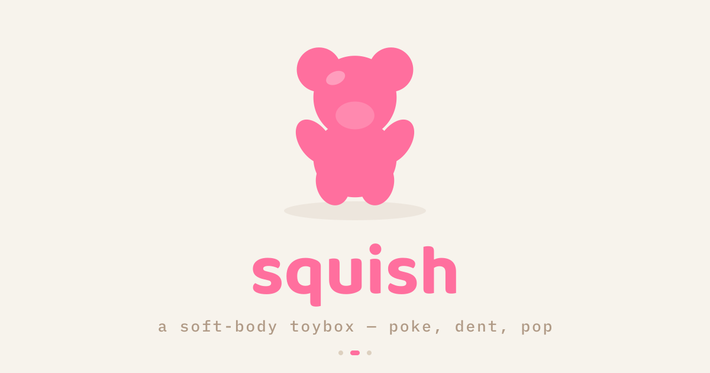

# squish 🩷



**[play it →](https://squishy.vercel.app)**

Poke, squish, dent, crack, pop, burst, and shatter twenty-four gummy, doughy,
and glassy little objects, all procedurally generated in the browser. No
assets to download, no build step.

## Run it locally

```sh
pnpm install
pnpm run dev
```

Opens at [localhost:6173](http://localhost:6173). It's plain HTML + ES
modules, so any static server works (just not `file://`). Three.js is
vendored in, so it runs offline — only hand tracking pulls MediaPipe from a
CDN, and only if you use it.

## How to play

Press and drag an object to squish it. Every one gives up differently: some
bounce right back, some keep the dent, some crack open, some burst or
shatter, and bubble wrap just pops.

Got a webcam? Click `hand` and play with your palm instead of the mouse —
open hand steers, a fist squeezes. Grab one of the arrow zones at the screen
edge to switch objects, or shake your hand to reset.

Keys work too: `1`–`9` pick an object, `r` resets, `p` fires a test squish.

## The pieces

- **`index.html` + `app.js`** — the page and the glue wiring it to the engine
- **`engine.js`** — the Three.js scene, GPU deformation, crack/burst/shatter
  effects, and procedural audio
- **`hand.js` + `hand.worker.js`** — webcam hand tracking, off the main thread
- **`squishies.js`** — every object as plain data: geometry, failure mode,
  tuning

Want to add one? Drop a new entry into `squishies.js` with an existing
geometry type and your own numbers — it shows up automatically. A new shape
needs a matching builder in `engine.js`.
